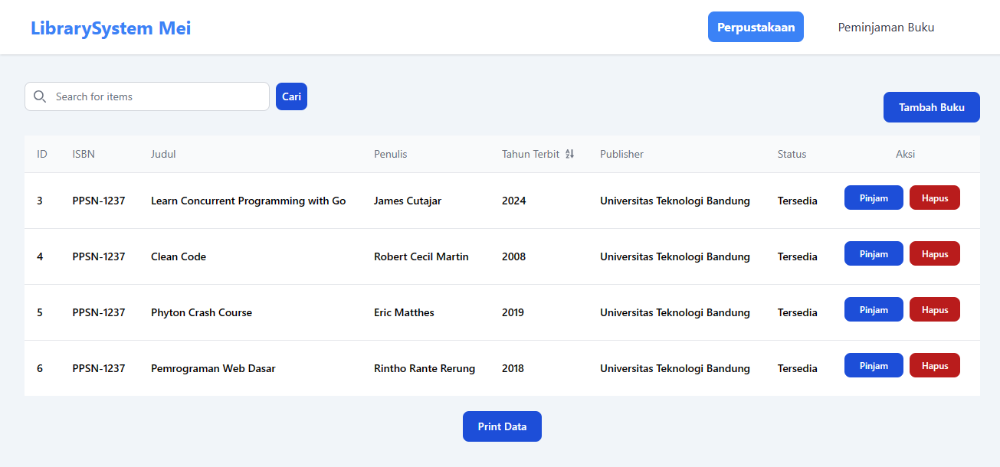
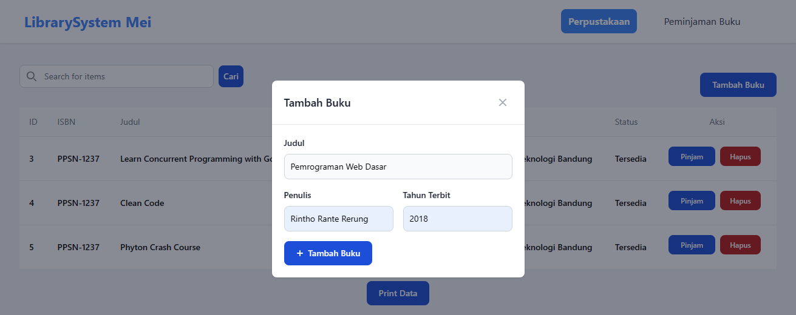
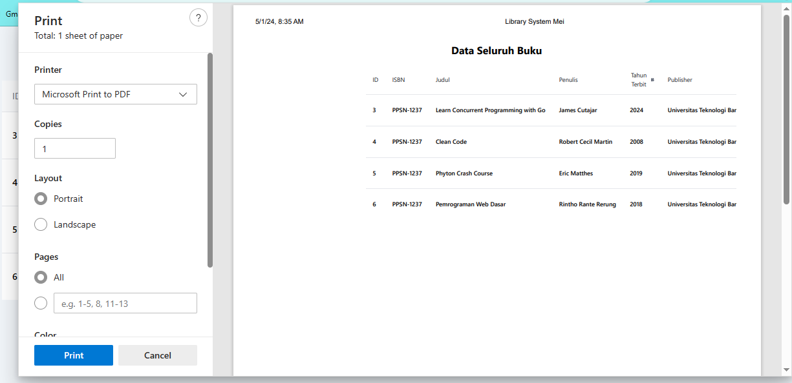
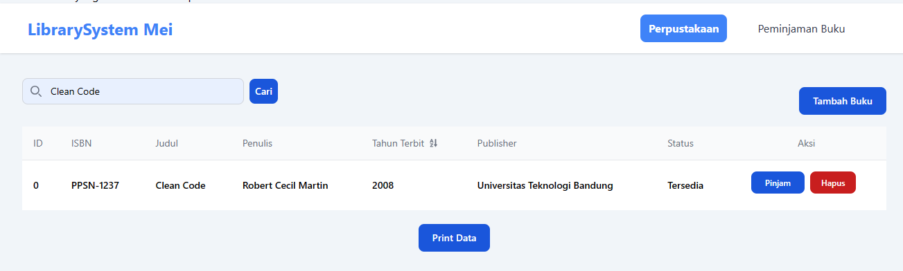
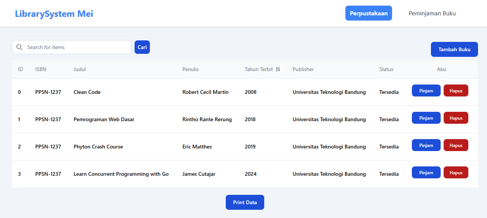
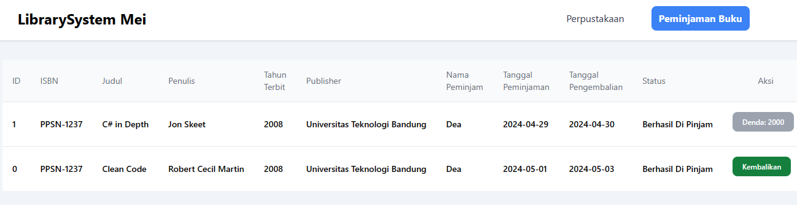

# Library System Mei
Library System Mei merupakan Website sistem perpustakaan dengan memanfaatkan Tailwind CSS untuk desain antarmuka pengguna. Dibangun dengan menggunakan bahasa pemrograman PHP, HTML, dan JavaScript.
Website ini menyediakan fitur-fitur yang intuitif dan mudah digunakan. 
## Fitur Utama 
- Penambahan buku baru dengan informasi seperti judul, penulis, tahun terbit, ISBN, dan informasi penerbit.
- Pencarian berdasarkan judul, penulis, atau tahun terbit.
- Proses peminjaman yang terintegrasi dengan pencatatan nama peminjam, tanggal peminjaman, dan tanggal pengembalian.
- Kemampuan untuk menghapus buku dari koleksi perpustakaan.
- Fasilitas pencetakan daftar buku.
## UI
### Beranda 

    

### Tambah Buku

    

### Cetak List Buku

    

### Pencarian Buku

    

### Urutan berdasarkan Tahun Terbit 

    

### Peminjaman dan Denda

    

## Ujian Tengan Semester Pemrograman Web 2 
### Nama    : Dea Meilani 
### NPM     : 21552011273
### Kelas   : TIF 221PC 

---
© 2024 Dea Meilani
